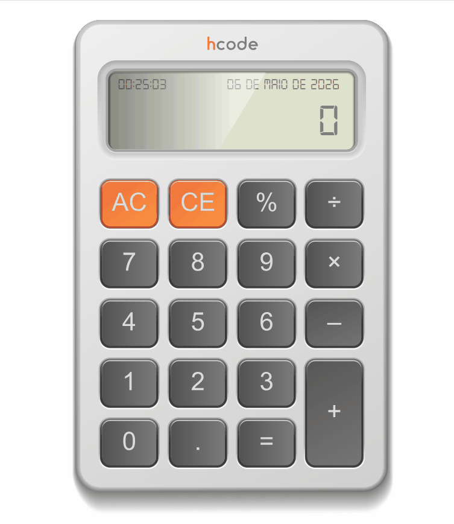

<h1 align="center"> Calculadora JavaScript</h1>

<p align="center">
  <strong>Uma calculadora moderna desenvolvida com HTML, CSS e JavaScript.</strong>
</p>

<p align="center">
  Projeto criado para praticar lógica de programação, manipulação do DOM, eventos e boas práticas com JavaScript.
</p>

<p align="center">
  
  
  
  
</p>

---

## Demonstração

<p align="center">
  
</p>

---

## Sobre o projeto

A **Calculadora JavaScript** é uma aplicação web simples e funcional, desenvolvida com foco em praticar os principais conceitos do JavaScript no navegador.

O projeto permite realizar operações matemáticas básicas através de uma interface intuitiva, responsiva e agradável.

---

## Funcionalidades

- ✅ Soma, subtração, multiplicação e divisão
- ✅ Limpar o visor
- ✅ Apagar último caractere
- ✅ Exibição de mensagens de erro
- ✅ Interação por clique
- ✅ Suporte a áudio de clique
- ✅ Interface simples e responsiva

---

## Tecnologias utilizadas

<div align="center">

| Tecnologia | Descrição |
|---|---|
| HTML5 | Estrutura da aplicação |
| CSS3 | Estilização e layout |
| JavaScript | Lógica e interatividade |
| DOM | Manipulação dos elementos da tela |

</div>

---

## 📂 Estrutura do projeto

```bash
📦 calculadora-javascript
 ┣ 📂 assets
 ┃ ┗ 📜 calcteste.gif
 ┣ 📂 scripts
 ┃ ┗ 📜 script.js
 ┣ 📜 index.html
 ┣ 📜 README.md
 ┣ 📜 click.mp3
 ┗ 📜 digital-7.ttf
```

---

## Como executar

```bash
# Clone o repositório
git clone https://github.com/lucasescouto-ux/Projeto-Calculadora.git

```

Depois, abra o arquivo `index.html` no navegador.

---

## Aprendizados

Durante o desenvolvimento deste projeto, foram praticados conceitos como:

- Manipulação do DOM
- Eventos de clique
- Funções em JavaScript
- Tratamento de erros
- Organização de arquivos
- Uso de fontes personalizadas
- Interatividade com áudio

<p align="center">
  ⭐ Projeto Calculadora - Trilha Saipos
</p>